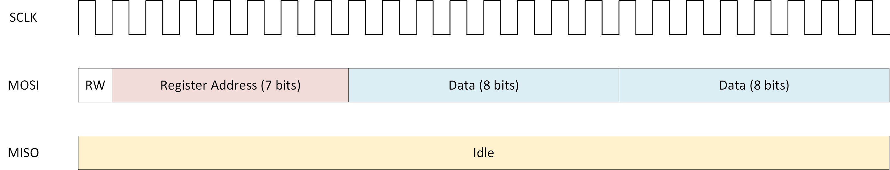
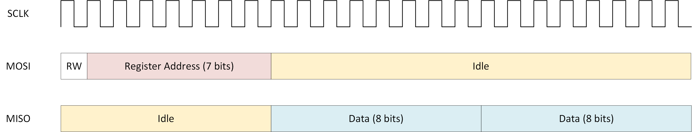

# Demo SPI Communication

- Version: 1.0

## Changelog

## Used projects

- [Communication](../../Projects/Communication/)
- [Common Source Files](../../Projects/CommonSourceFiles/)
- [RAM Two Port](../../Projects/RAMTwoPort/)

## Overview

This demo shows the simulation of 5 SPI sensors. Each of the sensors uses one of the nCS lines of the VT2710. Only channel 1 of the VT2710 is used for the sensors.

Each sensor has a register for data storage (using the 'RAM Two Port' project). Data can be written into the register and read from the register via systemvariables in CANoe and directly via a SPI message. In addition the phase (CPHA) and the polarity (CPOL) can be set via CANoe.

Register 1 (nCS_1) is initiliazed with a sine wave. Registers 2-5 are initiliazed with zeros.

Each sensors is simulated using the SPI block (*SPI.vhd*) inside a shell (*SPI_Channel.vhd*). The SPI is only used to receive and transmit raw data. The sensor behavior (interpreting incoming data and responding to it) is done in the shell. This is because a sensor can be vastly different from other sensors in terms of data structure and behavior.

### Shell (*SPI_Channel.vhd*)

The shell simulates a sensor with the following data structure

### Write Command

### Read Command

The MOSI data words set the register address and determine if data is received and should be written into the register or data from the register should be transmitted via the MISO signal. The interpretation of the received data words is done by the MOSI process (*proc_MOSI*).

In additon  the register (a RAM with two ports) is included as a component. The first port (a) is used by the SPI simulation. The second port (b) is used by CANoe. Via the second port data can directly be written into and read from the register using CANoe system variables.

### Top Level File (*SPI_GN.vhd*)

In this file 5 different SPI sensors are created. The output signal (MISO) is created by via an **AND** connective of all 5 different MISO signals from the sensors.

In addition a glitch filter is used to filter possible glitches on the SCLK, MOSI and nCS lines.

### CANoe

In the CANoe demo a single data word can be written with each frame via SPI using the existing panel. The read command reads two data words from consecutive register addresses. 

Please note that all 5 nCS signals must be connected. Otherwise the nCs signals that are not connected will not be recognized correctly and the appropriate sensors could be falsely active and receiving/sending data.