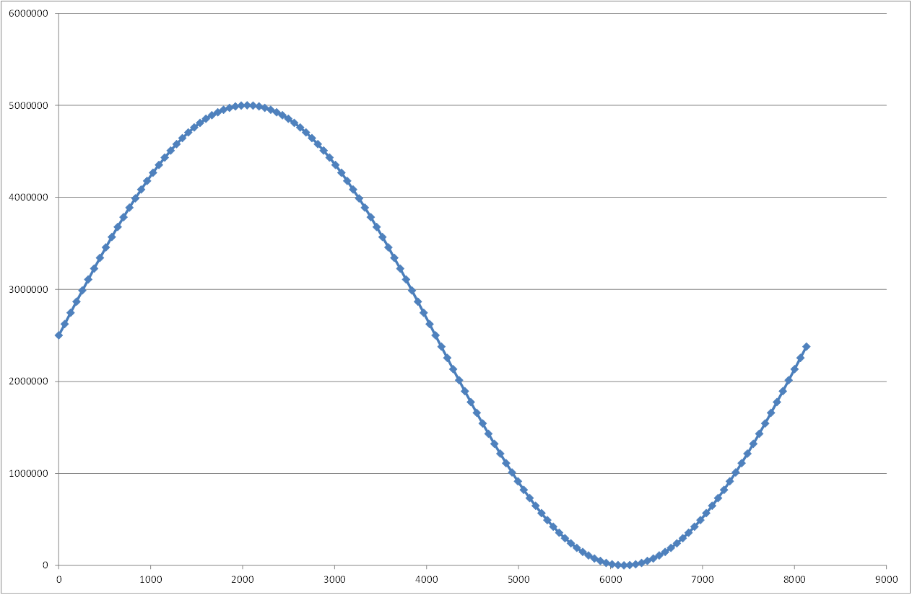

# Demo Phase Accumulator

- Version: 1.0

## Changelog


## Used projects

- [Common Source Files](../../Projects/CommonSourceFiles/)
- [Phase Accumulator](../../Projects/PhaseAccumulator/)
- [RAM Two Port](../../Projects/RAMTwoPort/)

## Overview

This demo shows how a phase accumulator can be used to read data from a RAM or how to directly generate a PWM signal. For this a counter with the size 80000000 (0..79999999; equal to the FPGA frequency) is used. The target frequency equals the increment of the counter. This way the frequency doesn't need to be converted to clock periods of the FPGA.

The RAM for the analog signal uses the 'RAMTwoPort' project. Because the way the interface of the RAM project is used, the compiler creates it as a single port ROM instead of a two port RAM.

For the creation of the PWM signal the counter of the phase accumulator is used. If an overflow occurs the signal is set to '1' (high). As soon as the counter value exceeds to duty cycle value the signal is set to '0' (low). Therefore one overflow of the counter equals one period of the PWM signal.

### Analog channels

All analog channels output a sine wave ranging from 0 V to +5 V. (The LSB of the user FPGA interface corresponds to 1 µV.) The frequency be be set betwenn -312.5 kHz and +312.5 kHz.

<p align="center"></p>

### Digital channels

All digital channels output a PWM signal. The frequency and duty cycle can be set for those signals.

<p align="center"></p>

## FPGA manager

For converting the values in CANoe to values needed by the user FPGA the posibilities in the FPGA manager are used.

### Analog Out channel

- **Frequency:** The factor for the frequency is needed because the FPGA in-/decrements the RAM address by 1 each time an overflow occurs. This means that 256 (equal to the RAM size) overflows are needed for a single period if each address should be used.

```math
Factor = {1 \over RAM size} = {1 \over 2^8} = {1 \over 256} = 0.00390625
```

```math
Min/Max = {F_{FPGA} \over RAM size} = {80000000 \over 256} = |312500|
```

- **Output Signal:** The factor of the output signal send to CANoe is used to convert the 1 µV base of the user FPGA to 1 V.

### Digital I/O channels
- **Duty cycle:** The factor for the duty cycle is needed to convert the DC [%] value to a counter value based on the size of the counter of the phase accumulator in the FPGA.

```math
Factor = {1 \over Size_{Counter} / Range_{DC} [\%]} = {1 \over 80000000 / 100} = 1.25 * 10^{-6}
```