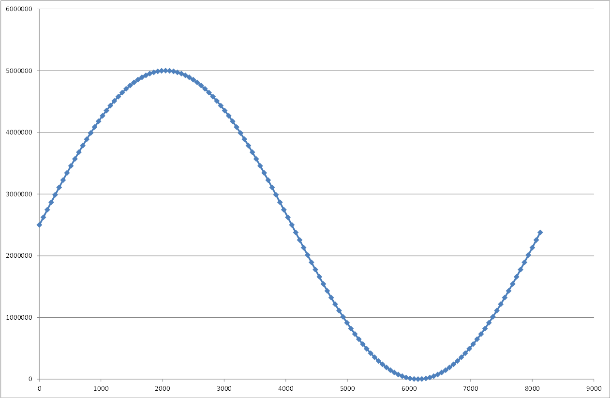

# Demo RAM Two Port

- Version: 1.0

## Changelog

## Used projects

- [Common Source Files](../../Projects/CommonSourceFiles/)
- [RAM Two Port](../../Projects/RAMTwoPort/)

## Overview

This demo shows the syntax of a RAM block each with two parallel write and read ports. This way CANoe (via system variables) and another process can access the RAM at the same time for example. The IP block for the RAM is applied to the analog output channels 1 and 2 of the VT5838 in CANoe. Only a single implementation of the IP block is used but instantiated twice. Each of the two instances has a .mif (memory initialization file) applied to it.

### Initialization

- **Channel 1:** a **sine wave** ranging from 0 V to +5 V (the LSB of the user FPGA interface corresponds to 1 µV) 

- **Channel 2:** a **sawtooth wave** ranging from 0 V to +5 V (the LSB of the user FPGA interface corresponds to 1 µV) 

