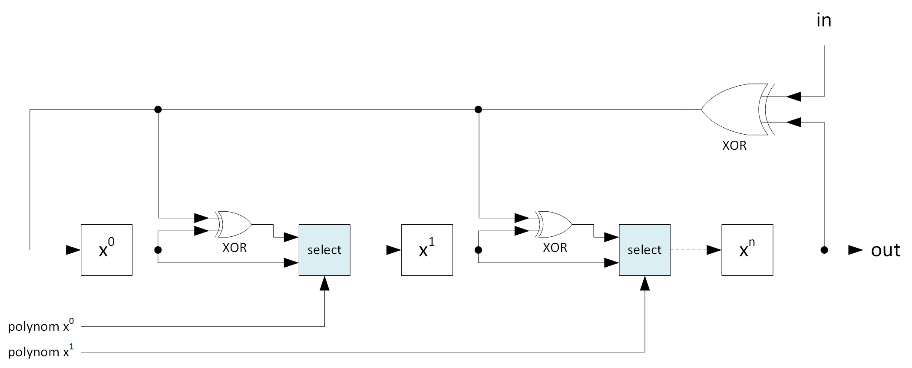
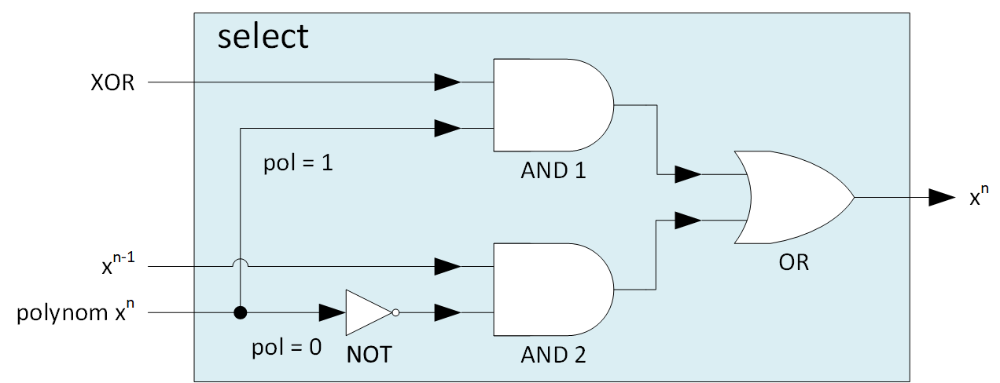
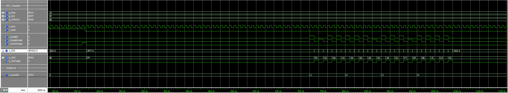

# CRC Template

- Version: 1.0

## Changelog

## Overview

This project contains code for a CRC template which can be used for different protocols (e.g. I2C).

## Generics

- **Poly:** polynomial of the CRC; the polynomial needs to be declared <u>without</u> the leeding '1' (no default value)
- **Init:** initial value of the shift registers (no default value)
- **XOR Out:** XOR logic for the CRC value (no default value)

## Input

- **Data Bit:** data bit that should be shifted next into the shift register
- **Data Bit Valid:** shows the template that the current data bit is valid; a new CRC is calculated for each clock cycle that the valid signal is high
- **Set Init Value:** writes the initial value specified in the generics into the shift register

## Output

- **CRC:** current CRC value
- **CRC Valid:** is set to high for 1 cycle when a new CRC value is valid

## Architecture

- the CRC Template uses a shift register with a width based on the size of the *Poly* generic
- each bit of the shift register, with the exception of x0, uses one of two input signals:
  - if the corresponding bit n of the polynom is '0' it uses the value of register xn-1
  - if the corresponding bit n of the polynom is '1' it uses the output of the XOR logic
- the template can output an inverted CRC value (via XOR Out bits)
- the template doesn't have code for *refin* or *refout*; they need to be implemented outside the template if necessary
- the template outputs the current CRC value after each shift operation

picture 1 shows the CRC logic, including the 2 possible paths for each bit in the shift register (except x0)

picture 2 shows the logic in the select block based on the correspnding bit of the polynomial

picture 3 shows a simulation of the polynomial x8 + x5 + x4 + x0 (0x31)

