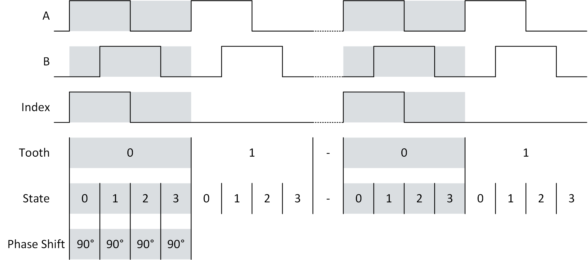
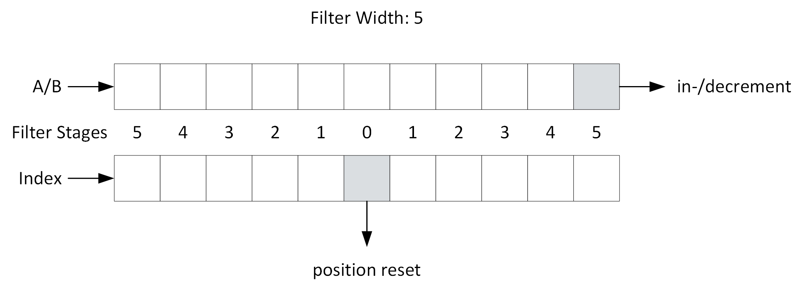
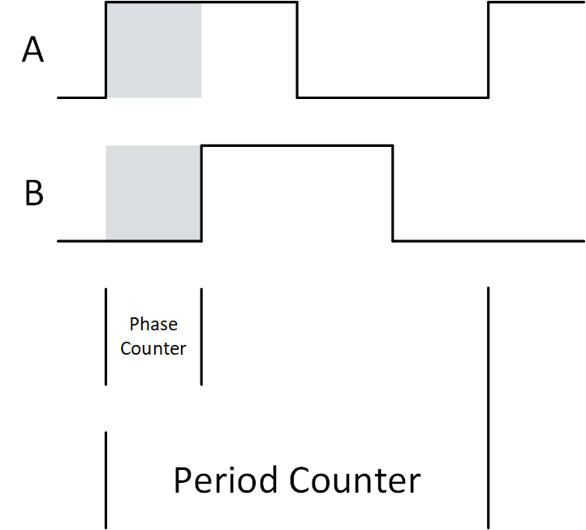

# Incremental Encoder

- Version: 1.0

## Changelog

## Overview

This project contains the VHDL code for a quadrature encoder and decoder.

## Encoder

### Generics

- **Counter Width:** Width of the counter and the data signals.

### Input

- **Number of Teeth:** Number of teeth for a signal (A or B).
- **States per Tooth:** Number of states per tooth of a signal so that the necessary resolution in [°] is possible. This value can be calculated with the following formula: $`StatesPerTooth = {360 [°] \over Resolution [°]}`$. A Resolution of 90° for example would need 4 states per tooth. (See picture below.)
- **Signal A, B Rising Edge State:** This signal is used to tell the FPGA at which state in a tooth the signal has a rising edge.
- **Signal A, B Falling Edge State:** This signal is used to tell the FPGA at which state in a tooth the signal has a falling edge.
- **Signal Index Rising Edge Tooth:** This signal is used to tell the FPGA at which tooth the index signal has a rising edge.
- **Signal Index Falling Edge Tooth:** This signal is used to tell the FPGA at which tooth the index signal has a falling edge.
- **Signal Index Rising Edge State:** This signal is used to tell the FPGA at which state in a tooth the signal has a rising edge.
- **Signal Index Falling Edge State:** This signal is used to tell the FPGA at which state in a tooth the signal has a falling edge.
- **Next State:** This signal tells the code when the next state should be output. It must be '1' for only one cycle.
- **Previous State:** This signal tells the code when the previous state should be output. It must be '1' for only one cycle.
- **Reset Position:** This sets the output position to the first state of the first tooth.

### Output

- **Signal A, B:** Those are the output signals A and B.
- **Signal Index:** This is the index signal.

### Architecture

- The signals A and B only have the information for the states of the  rising and falling edge in a tooth because the are identical in each tooth.
- The index signal has information for the state and the tooth of the rising and falling edge because they can occur in different teeth. It is possible to describe an index signal that spans more than one tooth.

- To create an A or B signal with a falling edge after the last state of a tooth (state transition 3 -> 0 in the picture above) the state for the falling edge has to be set to $`Falling Edge State \geqslant StatesPerTooth`$. The StatesPerTooth value ranges from 0 to 'StatesPerTooth - 1'. This leads to no falling edge being created in an existing state. Because each tooth begins with a low signal, unless overwritten by a rising edge in state 0, a falling edge is created automatically. This can be used e.g. if a phase difference of 180° should be created for A or B.

## Decoder

### Generics

- **Position Width:** Width of the position data. The default is 32 bits.
- **Filter Width:** Width of the filter for non-synchronous A/B and index signals.

### Input

- **A trails B:** This value determines which of the two signals (A & B) follows the other. 0: B follows A; 1: A follows B.
- **Signal A, B:** Those are the signals A & B.
- **Signal Index:** This is an optional index signal.
- **Reset Position:** This signal resets the position value to 0 on a rising edge.
- **Reset Error:** This signal resets the error flag on a rising edge.
- **Auto Max Position:** This signal determines if the max edge (beginning with 0; normally 4 times the number of teeth) is set manually or should be determined automtically when the index signal is recognized.
- **Max Position:** This value sets the max edge (beginning with 0 -> normally 4 times the number of the teeth - 1) if "Auto Max Position" is set to 0.

### Output

- **Position:** edge value beginning with 0. (range typically 0 ... 4 times number of teeth - 1)
- **Error:** This signal is an error flag showing a forbidden state change (e.g. "00" -> "11").

### Architecture

- The index signal uses a separate process so it's easier to modify or replace it in case of an unusual signal.
- If the max position is set to automatic then the current value is overwritten every time the index signal is recognized while moving in a positive direction. This means that two rotations over the index signal will result in the correct max position value. The first time to reset the position to 0. And the second time to get the max value.
- For the forward movement the rising edge of the index signal resets the position. For the backwards movement the falling edge of the index signal resets the position. 
- To prevent a position in-/decrement in the case of a slight phase difference between A/B signal and the index signal a filter is used to detect in-/decrement requests in the code in the proximity of a recognized index signal. The filter width is the number of FPGA cycles in front and behind the index signal that are filtered. The filter works by reseting the shift register of A/B if an applicable edge of the index signal is recognized. In-/decrement request still in the register are overwritten (A/b before index), as are A/B signals shifted into the register after the index signal (index before A/B).

## Phase Measurement

### Generics

- **Counter Width:** Width used for both counters
- **Phase Counter State:** Bitcombination of the signals A and B used as enable for the phase counter; default: A = '1' and B = '0'

### Input

- **Signal A, B:** Those are the signals A & B.

### Output

- **Phase Counter:** Number of clock cycles while *Phase Counter State* is fullfilled; reset after each period
- **Period Counter:** Number of clock cycles for a period; reset after each period; depending on the signal it could be the high part of one period and the low part of another because a rising edge of the signal triggers the reset of the counter

### Architecture

- the counter values values necessary to calculate the phase didfference are the period duration and duration for when the two signals are different
- the phase difference can be calculated using the following formula: $`Phase Difference [°] = 360 [°] * {Phase Counter \over Period Counter}`$
- ❗ **Limitation:** For this code to be used the high parts and low parts of both signals must overlap (which is the case for quadrature encoder signals).

