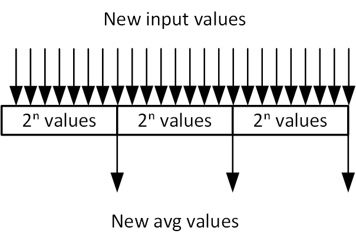
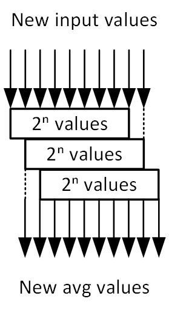
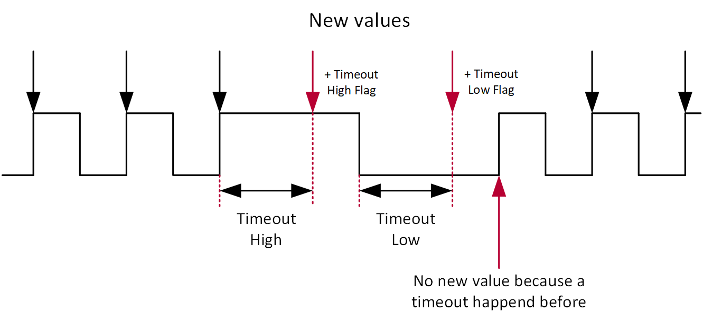

# Measurement

- Version: 1.1
    - fixed a bug in the frequency/duty cycle measurement code concerning the timeout 
    - removed TIMEOUT state from the FSM
- Version: 1.0

## Changelog

## Overview

This project is contains VHDL blocks used for measurement purposes.

## Measurement Blocks

- **Analog Avg:** A block needed to measure the average value of an analog input signal. It allows for a block average (data block by data block without overlapping values) or a rolling average (average calculated with each new value). The rolling variant uses more space because it has to save each incoming value and its position until the value is no longer needed.
- **Analog Min Max:** A block that measures the Min, Max values of an analog input signal.
- **Digital Frequency Duty Cycle:** A block that is used to measure the frequency and duty cycle of an digital input signal. The output are the counter values for the high pulse and the period which are necessary to calculate the real frequency and duty cycle values.

## Analog: Avg

### Generics

- **Data Width:** Width for the input signal and output data.
- **Block Size Exponent:** Determines the size of the array used to calculate the average value. Used for block and rolling.
- **Use Block:** Set to '1' if the block average should be used. Can be used with rolling.
- **Use Rolling:** Set to '1' if the rolling average should be used. CAn be used with block.

### Input

- **Signal:** The analog input signal.
- **New Value:** Signalizes a new input value used for to calculate the average value.

### Output

- **Avg Block:** Current value for the block avg.
- **Avg Rolling:** Current value for the rolling avg.
- **New Data Block:** Signalizes a new calculated block avg value.
- **New Data Rolling:** Signalizes a new calculated rolling avg value.

### Architecture

- Arrays have no overlapping values for the block calculation.
- Block Avg:

- Rolling Avg:

## Analog: Min & Max

### Generics

- **Data Width:** Width for the input signal and output data.

### Input

- **Signal:** The analog input signal.
- **New Value:** Signalizes a new input value used for to calculate the average value.
- **Reset Min Max:** Reset the current min and max values. Used for both.

### Output

- **New Data:** Signalizes a new min or max value. Doesn't distinguish between the two values.
- **Min:** Current min value.
- **Max:** Current max value.

### Architecture

- Compares each new value with the current min and max value.

## Digital: Frequency & Duty Cycle

### Generics

- **Counter Size:** Width of the counters used for the pulse and the period duration.

### Input 

- **Active:** Counters are only active while this signal is set to '1'. Otherwise counter values are 0.
- **Signal:** The digital input signal.
- **Timeout:** Timeout Duration.

### Output

- **New Data:** Signalizes new counter values. Set when a new period is recognized (rising edge).
- **Period Counter:** Counter value for a whole period.
- **Pulse Counter:** Counter value for the high pulse.
- **Timeout High:** Signalizes that a timeout occured during a high phase for one clock cycle. Used with 'New Data'.
- **Timeout Low:** Signalizes that a timeout occured during a low phase for one clock cycle. Used with 'New Data'.

### Architecture

- The timeout counter is reset with every edge of the input signal.
- Timeout:

